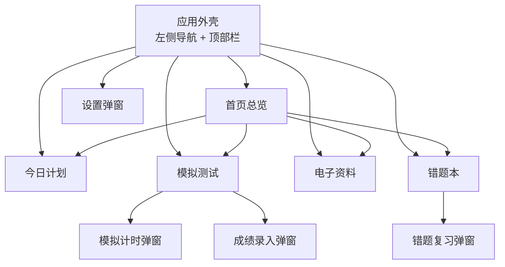

# 缘的考研舱 PRD

- 文档版本：v1
- 编写日期：2026-08-12
- 状态：已确认，作为后续开发依据

## 1. 产品目标与使用场景

缘的考研舱是一款只供本人使用的考研专属 APP，运行在 Windows 电脑的 Edge 浏览器中。

- 使用场景：个人日常复习，包括制定每日计划、安排模拟测试、管理电子资料、整理错题并复习。
- 产品目标：把考研复习中的计划、测试、资料、错题集中在一个本地应用中，打开就能用，数据不会因为刷新、关闭或重启电脑而丢失。
- 运行方式：本地运行，不需要登录、联网、云数据库、部署，也不做手机端。
- 技术约束：以 Edge 桌面浏览器为运行环境，使用浏览器本地文件读写能力将数据保存为电脑上的独立文件。

## 2. 整体页面框架和导航结构

应用采用桌面端布局，整体框架为：左侧固定导航栏 + 顶部栏 + 中间内容区。

- 左侧导航栏包含五个模块：
  - 首页总览
  - 今日计划
  - 模拟测试
  - 电子资料
  - 错题本
- 左侧导航栏底部显示：
  - 考试倒计时
  - 当前数据文件夹状态
- 顶部栏包含：
  - 当前页面标题
  - 当天日期
  - 备份按钮
  - 设置按钮
- 设置以弹窗形式打开，不是独立页面。
- 提供一个本地启动脚本，双击后自动打开 Edge 进入 APP。

## 3. 首页的内容结构

首页作为总览页，展示当天最重要的信息和各模块摘要。

- 考试倒计时卡片：
  - 距考试剩余天数
  - 考试日期
  - 今日计划完成进度
- 今日计划摘要卡：
  - 今日已完成数量与总数
  - 下一条未完成任务
  - 跳转到今日计划
- 快速备忘卡：
  - 快捷新增备忘
  - 最近备忘列表
  - 删除备忘
- 模块摘要卡：
  - 最近一场模拟测试
  - 电子资料数量
  - 待复习错题数量
  - 点击摘要跳转到对应模块

## 4. 每个模块的用途

- 今日计划：管理每天的学习安排，按日期查看、添加、完成和删除计划。
- 模拟测试：管理模拟卷，安排考试时间，进行计时模拟，记录成绩并查看历史结果。
- 电子资料：统一管理考研资料，登记资料信息，保存本地文件，支持搜索和筛选。
- 错题本：收集错题，记录错误答案和解析，按遗忘规律安排复习。

## 5. 每个模块第一版最必要的数据和操作

### 今日计划

必要数据：
- 计划日期
- 标题
- 科目
- 时间
- 优先级
- 完成状态

必要操作：
- 添加计划
- 勾选完成
- 删除计划
- 切换日期查看

### 模拟测试

必要数据：
- 测试名称
- 科目
- 考试日期
- 考试时长
- 满分
- 目标分
- 实际分数
- 备注
- 状态（待考/已完成）

必要操作：
- 添加模拟卷
- 开始模拟计时
- 提前交卷
- 时间到自动进入交卷
- 记录实际分数和备注
- 查看历史成绩
- 删除测试

### 电子资料

必要数据：
- 资料名称
- 科目
- 资料类型（教材/真题/网课/讲义/笔记/其他）
- 标签
- 文件本体
- 文件大小
- 添加日期

必要操作：
- 添加资料并复制文件到本地数据文件夹
- 打开已保存的文件
- 删除资料及对应文件
- 搜索资料
- 按科目和类型筛选

### 错题本

必要数据：
- 科目
- 来源
- 难度
- 题干
- 我的答案
- 正确答案
- 解析
- 标签
- 掌握状态（待复习/复习中/已掌握）
- 下次复习日期
- 复习次数

必要操作：
- 添加错题
- 进入复习
- 查看正确答案和解析
- 标记忘记/模糊/记得/掌握
- 自动计算下次复习日期
- 按科目和状态筛选
- 展开查看解析
- 删除错题

## 6. 首页、今日计划和各模块之间的关系

- 首页是总览入口，读取今日计划、模拟测试、电子资料和错题本的最新数据，以摘要形式展示。
- 今日计划是首页“今日计划摘要卡”的数据来源；在首页勾选任务会同步改变今日计划的完成状态。
- 模拟测试模块的数据变化会更新首页“最近一场模拟测试”摘要。
- 电子资料模块的数据变化会更新首页“资料数量”摘要。
- 错题本模块的数据变化会更新首页“待复习错题数量”摘要。
- 快速备忘只存在于首页，不单独成为一个模块。
- 首页摘要卡和模块之间通过跳转建立联系，点击后进入对应模块。

## 7. 本地数据文件、备份和恢复要求

### 数据保存

- 首次打开时，由用户选择或新建一个本地数据文件夹。
- 每次操作后自动保存，刷新、关闭浏览器、重启电脑后数据不丢失。
- 保存时先写临时文件再替换正式文件，避免中途关闭导致数据损坏。

### 数据文件夹结构

- `data.json`：保存全部业务数据。
- `resources/`：保存电子资料模块添加的文件。
- `backups/`：保存自动或手动备份副本。

### 备份与恢复

- 备份：把数据文件夹复制到用户选择的新位置，或生成带时间戳的备份副本。
- 恢复：选择备份文件夹或 `data.json` 文件，将数据恢复到应用。
- Edge 对本地数据文件夹的访问权限应持久保留，后续打开应用无需重复授权。

## 8. 第一版必须完成的功能

1. 首页总览：
   - 考试倒计时
   - 今日计划完成情况
   - 快速备忘
   - 模拟测试、电子资料、错题本摘要
   - 摘要跳转到对应模块
2. 今日计划：
   - 按日期添加、完成、删除计划
   - 设置科目、时间、优先级
   - 切换前后日期
3. 模拟测试：
   - 添加模拟卷
   - 模拟计时
   - 交卷并记录分数
   - 历史成绩展示
4. 电子资料：
   - 登记资料
   - 保存文件到本地数据文件夹
   - 打开和删除文件
   - 搜索与筛选
5. 错题本：
   - 录入错题
   - 复习并标记掌握程度
   - 自动安排下次复习日期
   - 筛选与查看解析
6. 设置弹窗：
   - 考试名称和考试日期
   - 科目管理
   - 数据文件夹位置
   - 备份与恢复

## 9. 第一版暂时不做的功能

- 登录和账号体系
- 云同步
- 手机端
- AI 功能
- 多人共享
- 独立桌面安装程序
- 复杂成绩统计系统
- 今日计划的单独编辑功能（删除后重建）
- 错题图片上传
- 在线资料下载

## 10. 可以实际检查的验收标准

### 运行与数据持久化

- 双击本地启动脚本后，Edge 自动打开 APP。
- 首次使用可以选择或新建本地数据文件夹。
- 在 APP 中完成任意操作后，数据文件夹中出现或更新 `data.json`。
- 刷新页面后数据仍在。
- 关闭浏览器并重新打开后数据仍在。
- 重启电脑后再次打开 APP，数据仍在。
- 不联网状态下 APP 可正常使用。

### 首页

- 首页能显示考试剩余天数。
- 首页能显示今日计划完成数量、下一条任务和快速备忘。
- 首页能显示模拟测试、电子资料、错题本的最新摘要。
- 点击首页摘要能进入对应模块。
- 在首页新增的备忘在刷新后仍然存在。

### 今日计划

- 可以添加带科目、时间、优先级的计划。
- 可以切换前后日期，不同日期的计划互不混淆。
- 勾选完成后，计划移入已完成区域，首页完成进度同步变化。
- 删除计划后，刷新页面不会恢复。

### 模拟测试

- 可以添加模拟卷并出现在待考列表。
- 点击开始模拟后进入倒计时，剩余时间实时变化。
- 提前交卷或时间结束后可以录入实际分数。
- 保存成绩后测试进入已完成列表，并显示分数、目标分和得分率。
- 刷新页面后成绩仍然存在。

### 电子资料

- 可以添加带文件或纯登记的资料。
- 带文件添加后，文件被复制到本地数据文件夹的 `resources/` 目录。
- 点击打开可以取得保存的文件。
- 删除资料后，对应文件也从数据文件夹移除。
- 搜索和筛选可以过滤资料列表。

### 错题本

- 可以添加错题并显示在错题列表中。
- 点击开始复习后，按待复习错题顺序逐题展示。
- 标记忘记/模糊/记得/掌握后，下次复习日期按规则更新。
- 已掌握错题移出待复习队列。
- 展开解析可以看到正确答案和解析内容。
- 按科目和状态筛选可以过滤列表。

### 备份与恢复

- 点击备份后，数据文件夹被复制到所选位置。
- 修改 APP 数据后，通过备份副本恢复，可以回到备份时点状态。
- 恢复操作完成后，刷新页面数据与备份一致。

### 设置

- 可以修改考试名称和考试日期。
- 可以修改科目名称和颜色，可以添加、删除科目。
- 可以查看当前数据文件夹位置并更换文件夹。
- 修改设置后刷新页面仍然保留。
